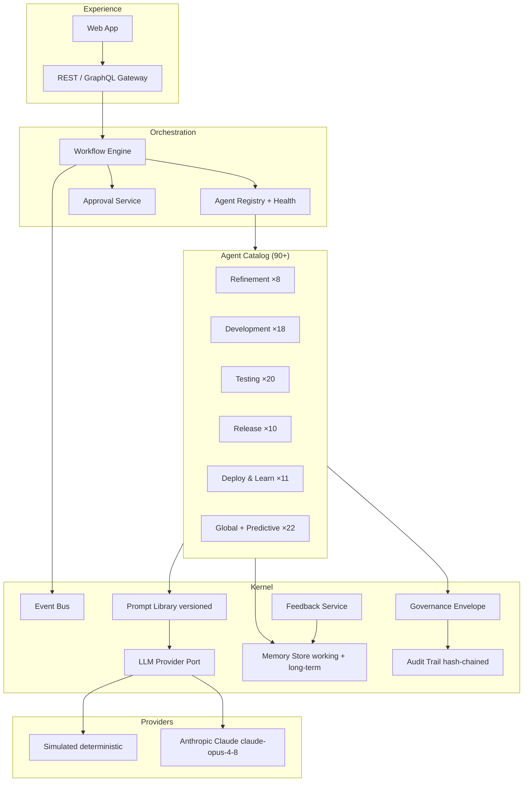

# Agent Architecture, Memory, Communication & Prompts

## 1. Layered architecture



Implementation: `packages/agent-kernel` (runtime), `packages/agents` (catalog),
`apps/api` (composition root + adapters).

## 2. Agent contract

Every agent implements one interface and is declared in the catalog
(`packages/agents/src/catalog.ts`):

```ts
interface AgentDefinition {
  id; name; phase; description;
  inputs; outputs;          // orchestration wiring + docs
  promptId;                 // versioned prompt in the library
  gatekeeper;               // blocks progression when true
  approverRoles; tags;
}
interface Agent {
  definition: AgentDefinition;
  execute(context: AgentContext): Promise<AgentDecision>;
}
```

`BaseAgent` enforces the platform invariant: implementations produce a domain
result (`analyze()`), the kernel enriches it with LLM narrative (knowledge-
grounded prompt from the library) and wraps it in the **governance envelope**
— reasoning, evidence, confidence, risk, business/technical/compliance impact,
recommended action, alternatives, approval status, prompt/LLM/knowledge
versions, timestamp, version. Nothing an agent produces is actionable without
the envelope.

### Execution classification

Every agent declares `execution` in its catalog entry, enforced by the kernel
and labelled throughout the UI:

- **`AI_ASSISTED`** (🤖) — deterministic core enriched with LLM reasoning.
  All judgement/analysis agents (refinement, reviews, compliance, predictions).
- **`DETERMINISTIC`** (⚙) — pure scripted logic; the kernel makes **no LLM
  call at all** (decisions record `llmVersion: deterministic`,
  `promptVersion: n/a`). The 11 plumbing/execution agents: test-data
  management, environment readiness, automation execution, deployment, CI/CD,
  agent health monitor, memory manager, prompt versioning, audit manager,
  notification manager, metrics.

Each decision additionally records which provider actually ran (`llmVersion`),
so the UI distinguishes 🤖 live AI, ⚙ offline-simulated, and ⚙ scripted.

### Hybrid inference

AI-assisted agents are **deterministic-first, LLM-enriched**:

- A deterministic domain layer (heuristics per agent: DoR scoring, INVEST
  checks, impact keyword rules, aspect evaluation) guarantees reproducible,
  offline-capable behaviour and grounds every claim.
- When a live provider is configured (`ANTHROPIC_API_KEY`), the kernel renders
  the agent's versioned prompt with heuristic output + retrieved knowledge and
  asks Claude (`claude-opus-4-8` by default) for expert narrative and gap
  detection. The hallucination-detector agent cross-checks narrative claims
  against evidence.
- Provider selection is a port (`LlmProvider`); Anthropic and Simulated
  adapters ship today, Bedrock/Vertex adapters slot in without kernel change.

## 3. Multi-agent communication (A2A)

Agents never call each other directly. Three sanctioned channels:

1. **Workflow context (primary).** The orchestrator merges every decision
   payload into run working memory under the producing agent's id; downstream
   agents read `context.input['story-analysis']` etc. This is typed, auditable
   data flow — the Three Amigos agent consumes Story Analysis output, the
   Refinement Gatekeeper consumes all six upstream payloads.
2. **Event bus.** Every state change publishes `workflow.*`, `approval.*`,
   `jira.*`, `knowledge.*` events. Reactive agents (monitoring, notification,
   health) subscribe with topic patterns. The in-process bus implements the
   same publish/subscribe port that Kafka/NATS implements in production.
3. **Knowledge platform.** Slow-path communication: learning agents write
   documents; all agents retrieve them (RAG). An incident recorded by the
   Incident Detection agent changes what the Story Analysis agent retrieves
   next sprint.

**MCP position:** external tools (JIRA, GitHub, Salesforce orgs, Confluence)
are exposed to agents as MCP servers in production deployments; the hexagonal
ports in `apps/api/src/jira.ts` define the same seams. A2A between QE.ai and
third-party agent platforms uses the event bus bridged over webhooks.

## 4. Agent memory design

| Layer | Contents | Lifetime | Implementation |
|---|---|---|---|
| **Working memory** | Per-workflow-run context: upstream payloads, story object | Run duration (cleared on rollback) | `MemoryStore.workingMemory` keyed by run id |
| **Long-term memory** | Knowledge documents from 14 source types, versioned | Permanent, versioned (`kb-vN`) | `MemoryStore.ingest/retrieve` |
| **Vector index** | Chunked embeddings of every document | Rebuilt on ingest | Deterministic hash embeddings in dev; pgvector/OpenSearch in production |
| **Episodic memory** | Decisions + feedback outcomes | Permanent | Decisions store + FeedbackService (feedback re-ingested as knowledge) |

Every decision records `knowledgeVersion`, so an auditor can reconstruct what
the agent knew at decision time.

## 5. Prompt library

- Every agent has a versioned prompt (`prompt-<agent-id>`); refinement agents
  carry hand-tuned system prompts (personas: principal BA, CTA, compliance
  expert, BDD designer, gatekeeper), the remainder derive their role prompt
  from the catalog definition. See `packages/agents/src/prompts.ts`.
- Template variables: `{{subjectId}}`, `{{input}}` (workflow context),
  `{{heuristics}}` (deterministic assessment), `{{knowledge}}` (RAG results).
- Versions are semver-ordered; the library serves the latest but retains all;
  the decision envelope pins the version used. Prompt changes are shipped by
  the Prompt Manager agent behind evaluation gates (see governance doc).

## 6. Adding an agent (extensibility recipe)

1. Add an `AgentDefinition` to the catalog (or tenant-level custom catalog).
2. Provide aspects for the heuristic engine **or** a `BaseAgent` subclass for
   deep domain logic.
3. Optionally register a hand-tuned prompt version.
4. Reference the agent id from any workflow definition.

No orchestrator, API or UI changes are required — registry, health, governance,
approvals and audit pick the new agent up automatically.
