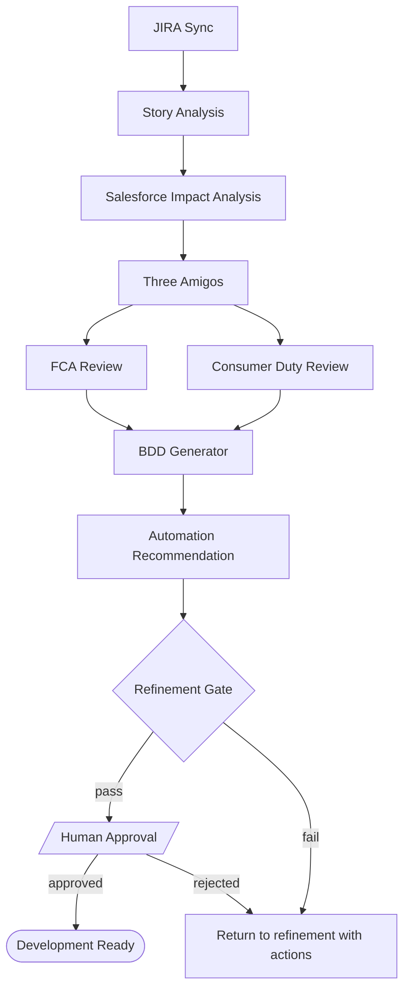
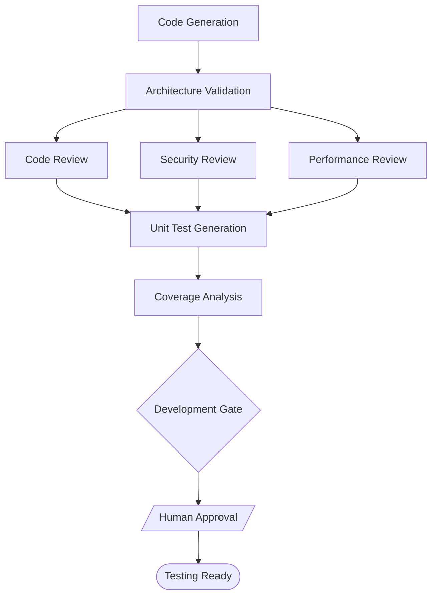
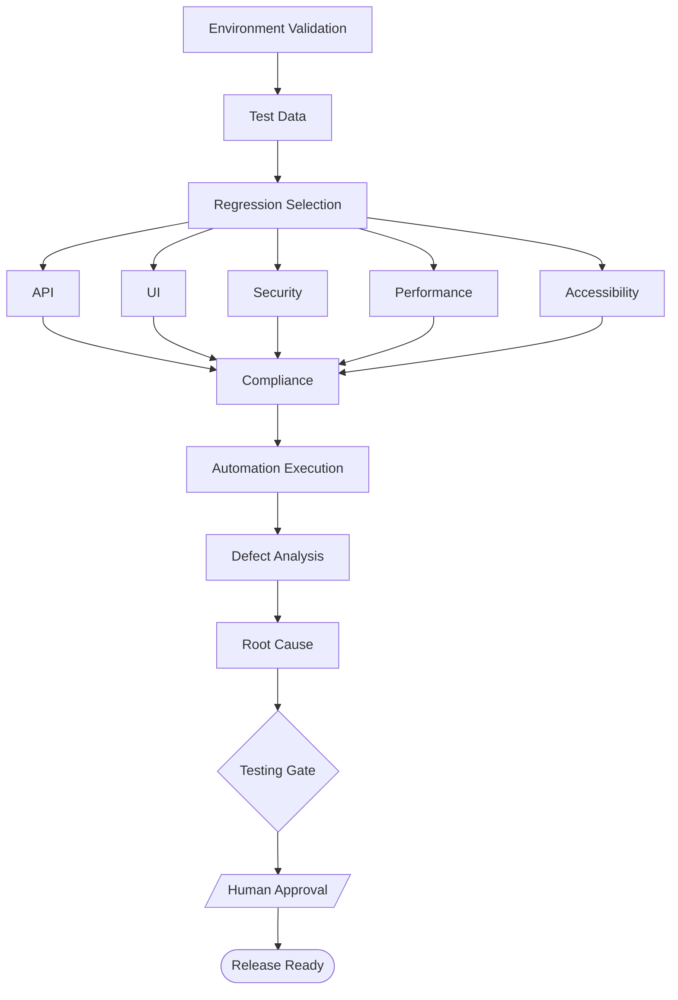
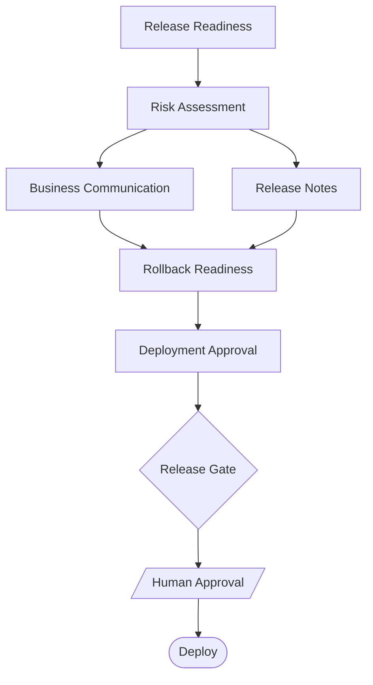
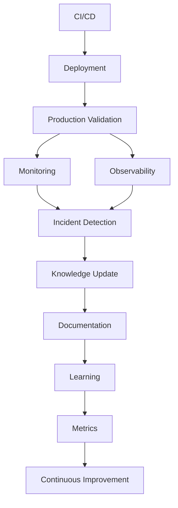
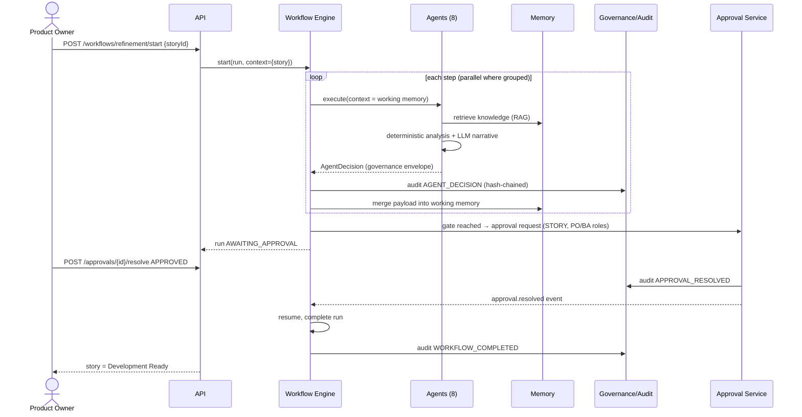
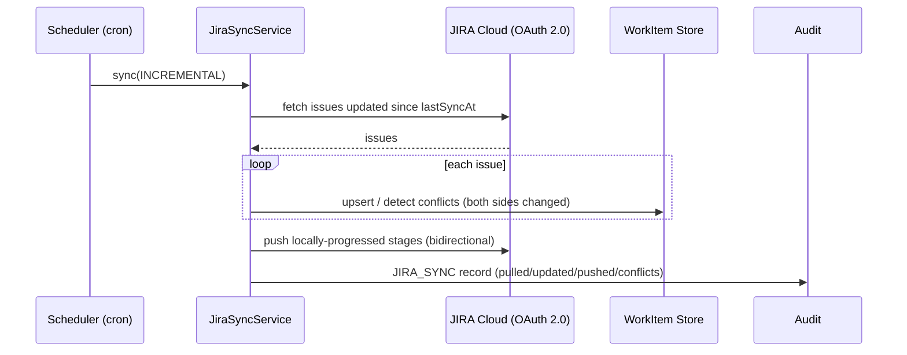
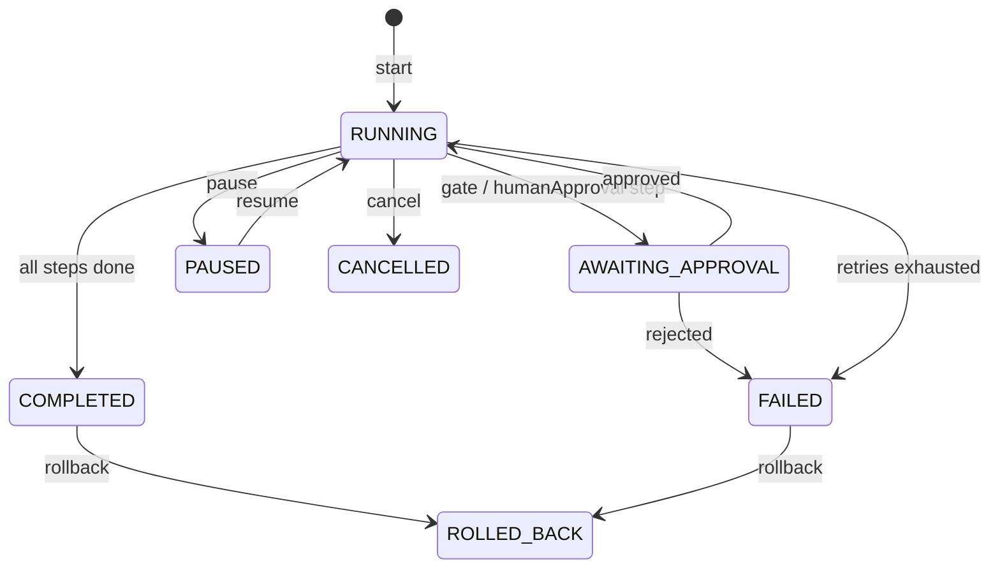

# Workflow & Sequence Diagrams

Workflows are configuration (`packages/agents/src/workflows.ts`): tenants can
re-order steps, change parallel groups, retries and approval points without
code changes. The orchestrator (`packages/agent-kernel/src/orchestrator.ts`)
provides sequential + parallel execution, retries, pause/resume/rollback,
human-approval gates, context passing, state, memory and mermaid rendering.

## Phase 1 — Refinement

FCA and Consumer Duty reviews run as a **parallel group**; the gate blocks on
INVEST, DoR ≥ 0.7, BDD completeness, risk review, compliance and automation
review, then always pauses for human approval.

## Phase 2 — Development

## Phase 3 — Testing

## Phase 4 — Release

## Phase 5 — Deploy & Learn

## Sequence — refinement run with human gate

## Sequence — JIRA bidirectional sync

## Orchestrator state machine

