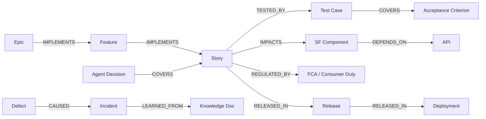

# Data Architecture — Database Schema, Knowledge Graph, Vector Store

The reference implementation ships in-memory stores behind port interfaces
(`apps/api/src/stores.ts`); production swaps them for the PostgreSQL schema
below without touching services or routes.

## 1. Relational schema (PostgreSQL 16)

All tables carry `tenant_id` with **row-level security**; hot per-tenant data
can additionally be split per-schema for ENTERPRISE tenants.

```sql
-- Tenancy & identity
CREATE TABLE tenants (
  id UUID PRIMARY KEY, name TEXT NOT NULL, plan TEXT NOT NULL,
  region TEXT NOT NULL, settings JSONB NOT NULL, created_at TIMESTAMPTZ NOT NULL
);
CREATE TABLE users (
  id UUID PRIMARY KEY, tenant_id UUID REFERENCES tenants,
  email CITEXT UNIQUE NOT NULL, display_name TEXT NOT NULL,
  roles TEXT[] NOT NULL, active BOOL NOT NULL DEFAULT TRUE
);

-- Work management (mirrored from JIRA, enriched by agents)
CREATE TABLE sprints (
  id UUID PRIMARY KEY, tenant_id UUID NOT NULL, jira_id TEXT,
  name TEXT, goal TEXT, state TEXT, start_date DATE, end_date DATE
);
CREATE TABLE work_items (
  id UUID PRIMARY KEY, tenant_id UUID NOT NULL, jira_key TEXT,
  type TEXT NOT NULL, parent_id UUID, title TEXT NOT NULL, description TEXT,
  status TEXT, stage TEXT NOT NULL, story_points NUMERIC,
  sprint_id UUID REFERENCES sprints, labels TEXT[],
  acceptance_criteria JSONB NOT NULL DEFAULT '[]',
  linked_prs TEXT[], linked_defects TEXT[], linked_test_cases TEXT[],
  created_at TIMESTAMPTZ, updated_at TIMESTAMPTZ,
  UNIQUE (tenant_id, jira_key)
);
CREATE INDEX ON work_items (tenant_id, sprint_id);
CREATE INDEX ON work_items (tenant_id, stage);

-- Orchestration
CREATE TABLE workflow_definitions (
  id TEXT, tenant_id UUID, version INT, phase TEXT, name TEXT,
  steps JSONB NOT NULL, PRIMARY KEY (tenant_id, id, version)
);
CREATE TABLE workflow_runs (
  id UUID PRIMARY KEY, tenant_id UUID NOT NULL, definition_id TEXT NOT NULL,
  definition_version INT, subject_type TEXT, subject_id UUID,
  status TEXT NOT NULL, steps JSONB NOT NULL, context JSONB NOT NULL,
  triggered_by TEXT, started_at TIMESTAMPTZ, finished_at TIMESTAMPTZ
);
CREATE INDEX ON workflow_runs (tenant_id, subject_id);

-- AI governance
CREATE TABLE agent_decisions (
  id UUID PRIMARY KEY, tenant_id UUID NOT NULL, agent_id TEXT NOT NULL,
  workflow_run_id UUID REFERENCES workflow_runs, step_id TEXT,
  subject_type TEXT, subject_id UUID,
  reasoning TEXT NOT NULL, evidence JSONB NOT NULL,
  confidence NUMERIC NOT NULL CHECK (confidence BETWEEN 0 AND 1),
  risk TEXT NOT NULL, business_impact TEXT, technical_impact TEXT,
  compliance_impact TEXT, recommended_action TEXT,
  alternatives JSONB, approval_status TEXT NOT NULL,
  payload JSONB NOT NULL,
  prompt_version TEXT NOT NULL, llm_version TEXT NOT NULL,
  knowledge_version TEXT NOT NULL, created_at TIMESTAMPTZ NOT NULL,
  version INT NOT NULL DEFAULT 1
);
CREATE INDEX ON agent_decisions (tenant_id, subject_id);

CREATE TABLE approvals (
  id UUID PRIMARY KEY, tenant_id UUID NOT NULL, type TEXT NOT NULL,
  title TEXT, status TEXT NOT NULL, subject_type TEXT, subject_id UUID,
  decision_id UUID REFERENCES agent_decisions, workflow_run_id UUID,
  required_roles TEXT[] NOT NULL, requested_by TEXT, assignee UUID,
  resolved_by UUID, comments JSONB NOT NULL DEFAULT '[]',
  created_at TIMESTAMPTZ, resolved_at TIMESTAMPTZ, expires_at TIMESTAMPTZ
);

-- Immutable audit (append-only; INSERT-only role; hash chain per tenant)
CREATE TABLE audit_events (
  id UUID PRIMARY KEY, tenant_id UUID NOT NULL, seq BIGINT NOT NULL,
  kind TEXT NOT NULL, actor TEXT NOT NULL, workflow_run_id UUID,
  agent_id TEXT, decision_id UUID, prompt_version TEXT, llm_version TEXT,
  knowledge_version TEXT, subject_type TEXT, subject_id TEXT,
  summary TEXT NOT NULL, detail JSONB NOT NULL,
  ts TIMESTAMPTZ NOT NULL, hash CHAR(64) NOT NULL, previous_hash CHAR(64) NOT NULL,
  UNIQUE (tenant_id, seq)
);
REVOKE UPDATE, DELETE ON audit_events FROM PUBLIC;

-- Feedback & testing
CREATE TABLE decision_feedback (
  id UUID PRIMARY KEY, tenant_id UUID NOT NULL,
  decision_id UUID REFERENCES agent_decisions, outcome TEXT NOT NULL,
  reviewer_id TEXT NOT NULL, comments TEXT, learning_outcome TEXT,
  created_at TIMESTAMPTZ NOT NULL
);
CREATE TABLE scenarios (
  id UUID PRIMARY KEY, tenant_id UUID NOT NULL, story_id UUID NOT NULL,
  feature TEXT, title TEXT, category TEXT, tags TEXT[],
  given JSONB, whens JSONB, thens JSONB,
  automation_candidate BOOL, ac_ids TEXT[]
);
CREATE TABLE test_executions (
  id UUID PRIMARY KEY, tenant_id UUID NOT NULL, scenario_id UUID,
  story_id TEXT, suite TEXT, result TEXT, duration_ms INT,
  environment TEXT, executed_at TIMESTAMPTZ, defect_key TEXT
);

-- Knowledge
CREATE TABLE knowledge_documents (
  id UUID PRIMARY KEY, tenant_id UUID NOT NULL, source TEXT NOT NULL,
  title TEXT NOT NULL, content TEXT NOT NULL, uri TEXT,
  version INT NOT NULL, tags TEXT[], ingested_at TIMESTAMPTZ NOT NULL
);
```

## 2. Vector database design

| Concern | Choice |
|---|---|
| Engine | `pgvector` (co-located, simplest ops) or OpenSearch/Pinecone at scale |
| Chunking | ~600-char chunks, document-anchored (`document_id`, `chunk_index`) |
| Embeddings | Provider-pluggable; dev mode uses deterministic 64-dim hash embeddings so retrieval works offline (`packages/agent-kernel/src/memory.ts`) |
| Index | HNSW, cosine similarity, per-tenant partial indexes |
| Versioning | Knowledge version increments on every ingest; decisions pin the version they retrieved against |

```sql
CREATE TABLE knowledge_vectors (
  id UUID PRIMARY KEY, tenant_id UUID NOT NULL,
  document_id UUID REFERENCES knowledge_documents,
  chunk_index INT, text TEXT NOT NULL, embedding vector(1024)
);
CREATE INDEX ON knowledge_vectors USING hnsw (embedding vector_cosine_ops);
```

Retrieval contract: `retrieve(tenantId, query, topK)` → `[{document, chunk,
score}]`, consumed by every agent through the kernel.

## 3. Knowledge graph

Property graph capturing end-to-end traceability (Neo4j/Neptune in production;
node/edge contracts in `packages/contracts/src/knowledge.ts`).

**Nodes:** `EPIC, FEATURE, STORY, TEST_CASE, DEFECT, RELEASE, DEPLOYMENT,
SF_COMPONENT, API, REGULATION, INCIDENT, AGENT_DECISION`

**Edges:** `IMPLEMENTS, TESTED_BY, COVERS, IMPACTS, DEPENDS_ON, CAUSED,
RESOLVED_BY, RELEASED_IN, REGULATED_BY, LEARNED_FROM`



Canonical queries:
- *Blast radius:* `MATCH (s:STORY)-[:IMPACTS]->(c:SF_COMPONENT)<-[:IMPACTS]-(other:STORY) RETURN other` — regression selection input.
- *Compliance evidence:* story → REGULATED_BY → regulation, joined to tagged scenarios and executions.
- *Escape analysis:* defect → CAUSED → incident → LEARNED_FROM → knowledge, linked back to the coverage gap.
