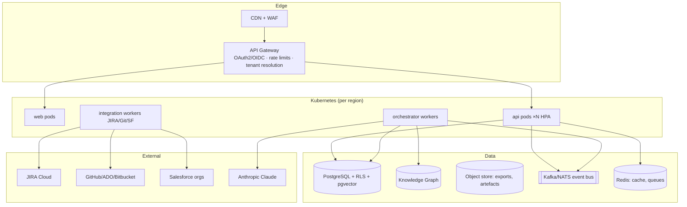

# Multi-Tenant SaaS, Deployment, CI/CD & Technology Stack

## 1. Multi-tenant SaaS architecture



**Isolation model:** shared cluster, isolated data. Every request resolves a
tenant at the gateway; RLS enforces it in the database; the orchestrator scopes
memory, knowledge and audit chains per tenant; token budgets and worker quotas
bound noisy neighbours. ENTERPRISE tenants may opt into dedicated schemas and
per-tenant encryption keys. The reference implementation encodes the same
boundaries in-process (every store, service and audit chain is tenant-keyed).

## 2. Deployment & CI/CD

- **Environments:** dev → staging → prod, promoted by artifact (immutable
  container digests), config via sealed secrets + per-env values.
- **Pipeline** (`.github/workflows/ci.yml`): install → typecheck → 30 tests →
  web build → Docker build & push (API + web) on main. Production adds:
  dependency/container scanning, SBOM, staged rollout (canary 10% → 100%) with
  automated rollback on SLO burn — executed by the platform's own CI/CD and
  Deployment agents (self-hosted dogfooding).
- **Kubernetes** (`infra/k8s/`): namespace, API Deployment (2 replicas, probes,
  resource limits, non-root, HPA 2→10 on CPU 70%), web Deployment, Services,
  TLS Ingress routing `/api` → api and `/` → web. Secrets via `qe-ai-secrets`
  (ANTHROPIC_API_KEY optional — platform degrades to deterministic mode).
- **Local/container:** `docker compose up` → web :8080, api :4000.
- **Observability:** OpenTelemetry SDK on every service; traces span
  workflow-run → step → LLM call; metrics feed the Agent Health Monitor;
  logs structured JSON with tenant + correlation ids.

## 3. Complete folder structure

```
qe-ai/
├── package.json                 # npm workspaces root
├── tsconfig.base.json
├── docker-compose.yml
├── .github/workflows/ci.yml    # CI/CD pipeline
├── docs/                        # deliverables 1–35 (this set)
├── packages/
│   ├── contracts/               # shared domain model (DDD ubiquitous language)
│   │   └── src/{tenancy,story,agents,workflow,approvals,audit,bdd,jira,events,metrics,knowledge}.ts
│   ├── agent-kernel/             # platform kernel (hexagonal core)
│   │   ├── src/{agent,registry,orchestrator,approvals,audit,memory,prompts,llm,eventBus,feedback,util}.ts
│   │   └── test/                 # 15 kernel tests
│   └── agents/                   # agent catalog + workflows + prompts
│       ├── src/{catalog,heuristics,refinement,workflows,prompts}.ts
│       └── test/                 # end-to-end pipeline tests
├── apps/
│   ├── api/                      # Fastify service (composition root + adapters)
│   │   ├── src/{main,server,platform,stores,jira,metrics,seed}.ts
│   │   └── test/                 # 10 API tests
│   └── web/                      # React SPA (Vite)
│       └── src/{App,api,types,theme.css,components/*,pages/*}
└── infra/
    ├── docker/{Dockerfile.api,Dockerfile.web,nginx.conf}
    └── k8s/{namespace,api,web}.yaml
```

**Architecture style:** DDD ubiquitous language in `contracts`; hexagonal
kernel (ports: `LlmProvider`, `JiraPort`, stores; adapters: Anthropic,
Simulated, Mock JIRA, in-memory/PostgreSQL); TDD (30 tests preceded fixes);
SOLID (single-purpose services, interface-driven composition root).

## 4. Technology stack

| Layer | Choice | Rationale |
|---|---|---|
| Language | TypeScript end-to-end (Node 22) | one type system across contracts/kernel/API/UI |
| API | Fastify 5 | fastest mainstream Node HTTP framework, schema-friendly |
| Orchestration | Custom kernel (this repo) → Temporal for long-lived runs at scale | durable state machines |
| AI | Anthropic Claude (`claude-opus-4-8` default) via provider port; deterministic simulated provider for offline/demo/test | governance requires provider pluggability |
| Data | PostgreSQL 16 + RLS + pgvector; Redis; Kafka/NATS; Neo4j (graph) | boring, proven, isolatable |
| Frontend | React 18 + Vite + hand-rolled SVG viz on a validated palette | fast, dependency-light, fully themable |
| Infra | Docker, Kubernetes (HPA, probes, non-root), nginx edge, GitHub Actions | portability + supply-chain control |
| Observability | OpenTelemetry → vendor-neutral backend | traces across agent steps |
